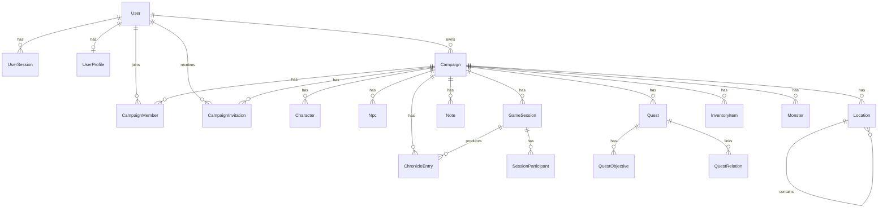

# Database Schema

## Overview

The backend uses PostgreSQL with Prisma schema defined in [`backend/prisma/schema.prisma`](../../backend/prisma/schema.prisma).

The data model is centered around campaigns. Most gameplay entities belong to a single campaign and are connected to users through ownership, authorship, or membership.

## High-Level ER Diagram

## Domain Groups

### Platform and identity

- `system_settings`: global key-value settings.
- `users`: primary user account record.
- `user_profiles`: optional extended profile and preferences.
- `user_sessions`: refresh-token-backed sessions for auth.

### Campaign workspace

- `campaigns`: campaign aggregate root for most business data.
- `campaign_members`: user membership, role, and lifecycle inside a campaign.
- `campaign_invitations`: invitation workflow before membership is accepted.

### Campaign content

- `characters`: player or campaign characters.
- `npcs`: non-player characters created inside a campaign.
- `locations`: hierarchical places inside a campaign.
- `notes`: campaign notes with visibility and optional loose relation metadata.
- `game_sessions`: scheduled or completed sessions.
- `session_participants`: attendance records for users in sessions.
- `chronicle_entries`: narrative log entries, optionally linked to sessions.
- `quests`: quests tracked for a campaign.
- `quest_objectives`: ordered quest steps.
- `quest_relations`: polymorphic links from quests to other entities.
- `inventory_items`: actual items owned by characters, parties, or other owners.
- `monsters`: campaign monsters and shared catalog entries.

### Shared catalog and integrations

- `external_references`: cached third-party content metadata, such as Open5e imports.
- `item_templates`: reusable item catalog definitions used by inventory items.

## Core Relationships

### Users and auth

- A `User` can have one `UserProfile`.
- A `User` can have many `UserSession` records.
- A `User` can own many `Campaign` records.
- A `User` can create many gameplay records such as `Npc`, `Location`, `Note`, `GameSession`, `ChronicleEntry`, and `Quest`.

### Campaign membership

- `Campaign.ownerId -> User.id` defines ownership.
- `CampaignMember` is the active membership join table between campaigns and users.
- `CampaignInvitation` stores invitation state before a member joins or declines.
- Both membership and invitation flows keep track of the inviting user where relevant.

### Campaign-bound content

- `Character`, `Npc`, `Location`, `Note`, `GameSession`, `ChronicleEntry`, `Quest`, and `InventoryItem` belong to exactly one campaign.
- `Monster` may belong to a campaign or act as a shared catalog entry when `campaignId` is `NULL`.
- `Location` supports parent-child nesting via `parentLocationId`.
- `ChronicleEntry` may optionally reference a `GameSession`.

### Session and quest structures

- `SessionParticipant` links a user to a session with attendance metadata.
- `QuestObjective` is a child collection of `Quest`, ordered by `sortOrder`.
- `QuestRelation` stores polymorphic associations using `entityType` + `entityId`.

## Table Notes

### Soft delete and archival fields

Several tables use lifecycle timestamps instead of hard deletes:

- `users.deletedAt`
- `campaigns.archivedAt`, `campaigns.deletedAt`
- `characters.deletedAt`
- `npcs.deletedAt`
- `locations.deletedAt`
- `notes.deletedAt`
- `monsters.deletedAt`
- `quests.deletedAt`
- `inventory_items.deletedAt`

This means query layers need to consciously filter archived or deleted records.

### Visibility and status fields

Many entities use string-based domain enums stored in columns such as:

- `status`
- `visibility`
- `type`
- `priority`
- `source`

These values are enforced at the application/domain layer rather than with database enum types.

### JSON-backed flexible fields

The schema intentionally keeps some complex or evolving data in JSON columns, for example:

- `characters.customData`
- `characters.skills`, `savingThrows`, `spellcasting`
- `npcs.statBlock`
- `monsters.actions`, `traits`, `rawData`
- `locations.coordinates`
- `item_templates.properties`
- `inventory_items.customProperties`
- `external_references.rawData`, `normalizedData`

This keeps imports and system-specific RPG data flexible without requiring constant migrations.

### Polymorphic or loose references

Some columns look like relations but are not enforced by foreign keys in Prisma:

- `notes.relatedEntityType` + `notes.relatedEntityId`
- `quests.giverNpcId`
- `quests.relatedLocationId`
- `quest_relations.entityType` + `quest_relations.entityId`
- `inventory_items.ownerType` + `inventory_items.ownerId`
- `npcs.locationId`
- `monsters.externalReferenceId`
- `item_templates.externalReferenceId`
- `inventory_items.externalReferenceId`

These are application-managed references, useful for polymorphism or decoupled integrations, but they require extra care in handlers and read models.

## Important Constraints and Indexes

- `users.email` and `users.username` are unique.
- `campaigns.slug` is unique.
- `campaign_members` is unique on `campaignId + userId`.
- `campaign_invitations` is unique on `campaignId + userId + status`.
- `monsters` is unique on `campaignId + slug`.
- `session_participants` is unique on `sessionId + userId`.
- `quest_relations` is unique on `questId + entityType + entityId + relationType`.
- `external_references` is unique on `provider + resourceType + key`.

The schema also adds targeted indexes for common filters such as campaign scope, lifecycle fields, visibility, and status.

## Practical Reading Guide

If you want to understand the schema quickly, read it in this order:

1. `users`, `user_profiles`, `user_sessions`
2. `campaigns`, `campaign_members`, `campaign_invitations`
3. Campaign content tables such as `characters`, `npcs`, `locations`, `notes`
4. Timeline and collaboration tables: `game_sessions`, `session_participants`, `chronicle_entries`
5. Progress and catalog tables: `quests`, `quest_objectives`, `quest_relations`, `monsters`, `item_templates`, `inventory_items`, `external_references`
